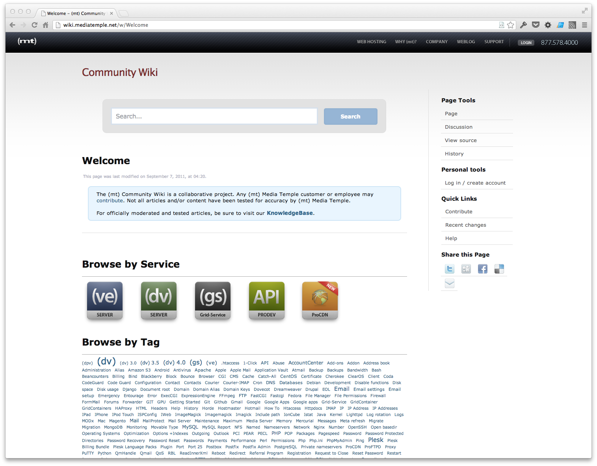

While at (mt) Media Temple, we wanted a easier way to allow customers to help create how-to articles for other users in one easy to search site. Built on MediaWiki you can now find a open source version that was never released on [Github](https://github.com/bhubbard/MediaWiki-SimpleGray).

<a href="http://wiki.mediatemple.net" target="_blank" class="btn btn-inverse">Visit Site</a>
